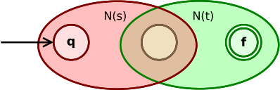

# Compiler Principle - Regex_cmp

>   17341137 宋震鹏

[toc]

<div style="page-break-after: always;"></div>

## 1 Restatememt


---

<div style="page-break-after: always;"></div>

## 2 Algorithms

The program logic is simple and made of four sections:

1.  Regex expressiong to NFA.
2.  NFA to DFA.
3.  Minimize DFA.
4.  Compare two minimized DFAs.

### 2.1 Definitions

1.  `Node` in NFA

    ```cpp
    struct Node {
        int id;
        unordered_map<string, vector<Edge*>> in;
        unordered_map<string, vector<Edge*>> out;
        Node(int id): id(id) {}
    };
    ```

    -   id: node id, indexed from 0.
    -   in: map in-edges by there value(e.g. in["a"] = {Edge1,...})
    -   in: map out-edges by there value(e.g. in["a"] = {Edge1,...})

    To map ids to corresponding `Node`: 

    ```cpp
    unordered_map<int, Node*> nodes;
    ```

2.  `Edge` in NFA

    ```cpp
    struct Edge {
        Node* from;
        Node* to;
        string by;
        Edge(Node* from, Node* to, string by): from(from), to(to), by(by) {}
    };
    ```

    *   from: `Node` the `Edge` comes from.
    *   to: `Node` the `Edge` goes to.
    *   by: value of the edge(e.g. "a").

3.  `NFA` structure

    ```cpp
    struct NFA {
        Node* start;
        Node* end;
        NFA(Node* start, Node* end): start(start), end(end) {}
    };
    ```

    -   start: start `Node`.
    -   end: end `Node`.

4.  NFA in graph form: `NFAmap`

    ```cpp
    vector<vector<string>> NFAmap;
    ```

    <div style="page-break-after: always;"></div>

5.  DFA Dtrans table: `Dtrans`

    ```cpp
    vector<DtranElem*> Dtrans;
    ```

    Minimized one:

    ```cpp
    vector<vector<char>> miniDtrans;
    ```

    In different form:

    ```cpp
    /**
     * (Number of DFA state * (DFA state, [pattern1, ..., ACC]))
     * Sample: (DFA state, [pattern1, ..., ACC])
     *         (A, [B, C, \, D, N(No)])
     */
    vector<pair<char, vector<char>>> minimizedDtrans;
    ```

6.  `DtranElem` in DFA Dtrans table

    ```cpp
    struct DtranElem {
        set<Node*> nfa_set;
        char dfa_state;
        vector<DtranElem*> to;
        DtranElem(set<Node*> nfa_set, char dfa_state, vector<DtranElem*> to):
            nfa_set(nfa_set), dfa_state(dfa_state), to(to) {}
        DtranElem(set<Node*> nfa_set, char dfa_state):
            nfa_set(nfa_set), dfa_state(dfa_state) {}
    };
    ```

    *   nfa_set: set of `Node`s the current Dtran element contains.
    *   dfa_state: state of the current Dtran element.
    *   to: array of Dtran elements which are accessible from current one, in lexicographical order.

7.  list of pattern in expression: `pattern_list`

    ```cpp
    vector<string> pattern_list;
    ```

    e.g.: pattern_list = {"a", "b", ...}

<div style="page-break-after: always;"></div>

### 2.2 Regex expressiong to NFA

#### 2.2.1 Pattern List

AKA. alphabet list, which means how many and which alphabet is included in the expression.

It's a simple 1-pass job.

```cpp
/**
 * Parse and get Pattern List.
 * e.g.: exp = a+bc
 *  ==> pattern list = {a, b, c}
 */
void getPatternList(string exp)
{
    vector<int> existed(26, 0);
    for (auto i : exp) {
        if (islower(i) && !existed[i - 'a']) {
            pattern_list.push_back(string(1, i));
            existed[i - 'a'] = 1;
        }
    }
    sort(pattern_list.begin(), pattern_list.end());
}
```

#### 2.2.2 Add catenation symbol

Since the parsing process is done with stack and operators, it's necessary to add a catenation symbol `@` to correct place.

```cpp
/**
 * Add a catenation symbol `@`
 * to correct place.
 */
string AddCatSymbol(string exp)
{
    int i = 0, j, n = exp.length();
    while (i < n) {
        if (((exp[i] != '(' && exp[i] != '@' && exp[i] != '|')
             || exp[i] == ')'
             || exp[i] == '*')
            && (islower(exp[i + 1]))) {
            exp += exp[n - 1];
            for (j = n - 1; j > i + 1; j--) {
                exp[j] = exp[j - 1];
            }
            exp[i + 1] = '@';
            n++;
            i++;
        }
        i++;
    }
    return exp;
}
```

<div style="page-break-after: always;"></div>

#### 2.2.3 RegExpToPost

This subtask was done early in Exp4, note that there's still a `#` left in the stack when job is done.

```cpp
/**
 * Transfer expression `exp`
 * to postfix type.
 */
string RegExpToPost(string exp)
{
    exp = AddCatSymbol(exp);
    int i = 0, j = 0, n = exp.length();
    char ch, cl;
    string postfix(n, ' ');
    stack<char> s;
    s.push('#');
    ch = exp[i];
    while (i < n) {
        if (ch == '(') {
            s.push(ch);
            ch = exp[++i];
        }
        else if (ch == ')') {
            while (s.top() != '(') {
                postfix[j++] = s.top();
                s.pop();
            }
            s.pop();
            ch = exp[++i];
        }
        else if ((ch == '|') || (ch == '*') || (ch == '@')) {
            cl = s.top();
            while (priority[cl] >= priority[ch]) {
                postfix[j++] = cl;
                s.pop();
                cl = s.top();
            }
            s.push(ch);
            ch = exp[++i];
        }
        else {
            postfix[j++] = ch;
            ch = exp[++i];
        }
    }
    ch = s.top();
    s.pop();
    while ((ch == '|') || (ch == '*') || (ch == '@')) {
        postfix[j++] = ch;
        ch = s.top();
        s.pop();
    }
    while (postfix.back() == ' ') {
        postfix.pop_back();
    }
    return postfix;
}
```

<div style="page-break-after: always;"></div>

#### 2.2.4 Thompson's construction

Code in this program use strict [Thompson's construction]([https://en.wikipedia.org/wiki/Thompson%27s_construction](https://en.wikipedia.org/wiki/Thompson's_construction)) and gives a correct NFA.

-   expression D(epsilong or symbol a)

    

    

-   Union(|)

    

-   concatenation(@)

    

-   closure(*)

    

Please refer to online code [here](https://paste.ubuntu.com/p/Vm23wHX6Pb/).


## 3 NFA to DFA

Code in this program use strict [Powerset construction](https://en.wikipedia.org/wiki/Powerset_construction) and transfer NFA to a DFA which may not be minimized.

### 3.1 epsilon closure

```cpp
/**
 * Build a epsilon-closure of all nodes
 * from `node_set`.
 */
set<Node*> epsClosure(set<Node*> node_set)
{
    set<Node*> s(node_set.begin(), node_set.end());
    stack<Node*> stk;
    for (auto i : node_set) {
        stk.push(i);
    }
    while (!stk.empty()) {
        auto tmp = stk.top();
        stk.pop();
        for (int i = 0; i < idx; i++) {
            if (NFAmap[tmp->id][i] == EPS && s.find(nodes[i]) == s.end()) {
                s.insert(nodes[i]);
                stk.push(nodes[i]);
            }
        }
    }
    return s;
}
```

### 3.2 move function

```cpp
/**
 * Get a set of nodes, which is generated by:
 * Moving all nodes in `node_set` through `by`.
 */
set<Node*> move(set<Node*> node_set, string by)
{
    set<Node*> s;
    for (auto node : node_set) {
        for (int i = 0; i < idx; i++) {
            if (NFAmap[node->id][i] == by) {
                s.insert(nodes[i]);
            }
        }
    }
    return s;
}
```

<div style="page-break-after: always;"></div>

### 3.3 Powerset construction

Powerset construction is base on the 2 function above:

```cpp
/**
 * Build Dtrans from given nfa `init_nfa_set`.
 */
void buildDtrans(set<Node*> init_nfa_set)
{
    DtranElem* A = new DtranElem(init_nfa_set, getDFAState(init_nfa_set));
    queue<DtranElem*> s;
    s.push(A);
    while (!s.empty()) {
        auto tmp = s.front();
        s.pop();
        for (auto by : pattern_list) {
            auto new_nfa_set = epsClosure(move(tmp->nfa_set, by));
            auto new_dfa_state = getDFAState(new_nfa_set);
            if (new_dfa_state == '\0') {
                tmp->to.push_back(NULL);
            }
            else if (new_dfa_state <= tmp->dfa_state) {
                tmp->to.push_back(Dtrans[new_dfa_state - 'A']);
            }
            else {
                DtranElem* new_elem = new DtranElem(new_nfa_set, new_dfa_state);
                tmp->to.push_back(new_elem);
                s.push(new_elem);
            }
        }
        Dtrans.push_back(tmp);
    }
}
```

Note that, when a new DFA state comes out, the function add a new element in Dtrans table.

<div style="page-break-after: always;"></div>

## 4 Minimize DFA

To minimize a DFA, just divide the DFA state into 2 partitions first.

1.  Accecpt states.
2.  Non-accept states.

Then, keep trying to split the partitions as many sub-partitions as possible.

When no change take place after a loop, DFA is guaranteed to be the minimal one. 

```cpp
/**
 * Do minimization.
 */
void minimizeDFA()
{
    // init
    vector<vector<char>> partitions(2, vector<char>());
    for (int i = 0; i < miniDtrans.size(); i++) {
        if (miniDtrans[i].back() == 'N') {
            partitions[0].push_back(char(i + 'A'));
        }
        else {
            partitions[1].push_back(char(i + 'A'));
        }
    }

    // Keep trying to split
    // until no change take place.
    while (1) {
        bool nochange = true;

        // for each partitions, partialize it
        int len = partitions.size();
        for (int i = 0; i < len; i++) {
            // single-content partition can never split
            if (partitions[i].size() <= 1) {
                continue;
            }

            vector<vector<char>> new_partitions;
            vector<bool> visited(partitions[i].size(), false);
            for (int j = 0; j < partitions[i].size(); j++) {
                if (visited[j]) {
                    continue;
                }
                vector<char> new_partition(1, partitions[i][j]);
                vector<int> group = getToGroup(partitions, partitions[i][j]);
                for (int k = j + 1; k < partitions[i].size(); k++) {
                    if (!visited[k]) {
                        auto tmp = getToGroup(partitions, partitions[i][k]);
                        if (tmp == group) {
                            new_partition.push_back(partitions[i][k]);
                            visited[k] = true;
                        }
                    }
                }
                new_partitions.push_back(new_partition);
            }
            if (new_partitions.size() > 1 || partitions[i] != new_partitions[0]) {
                nochange = false;
            }

            partitions[i].resize(new_partitions[0].size());
            copy(new_partitions[0].begin(), 
                 new_partitions[0].end(), 
                 partitions[i].begin());
            if (new_partitions.size() > 1) {
                partitions.insert(partitions.end(),
                                  new_partitions.begin() + 1,
                                  new_partitions.end());
            }
        }
        if (nochange) {
            break;
        }
    }

    vector<char> group_map(26, '~');
    for (auto p : partitions) {
        if (p.empty()) {
            continue;
        }
        for (int j = 1; j < p.size(); j++) {
            group_map[p[j] - 'A'] = p[0];
        }
        if (p.size() > 0) {
            group_map[p[0] - 'A'] = p[0];
        }
    }

    for (auto p : partitions) {
        if (p.empty()) {
            continue;
        }
        auto tmp = miniDtrans[p[0] - 'A'];
        for (int i = 0; i < tmp.size() - 1; i++) {
            tmp[i] = group_map[tmp[i] - 'A'];
        }
        minimizedDtrans.push_back(make_pair(p[0], tmp));
    }

    sort(minimizedDtrans.begin(), minimizedDtrans.end(), [](auto x, auto y) {
        return (x.second.back() == y.second.back()) ? 
            x.first < y.first : x.second.back() < y.second.back();
    });

    for (int i = 0; i < minimizedDtrans.size(); i++) {
        if (minimizedDtrans[i].first != 'A' + i) {
            char from = minimizedDtrans[i].first, to = 'A' + i;
            for (auto& j : minimizedDtrans) {
                for (auto& k : j.second) {
                    k = (k == from) ? to : k;
                }
            }
            minimizedDtrans[i].first = to;
        }
    }

}
```


## 5 Relationship

As introduce at the beginning, the program should be able to judge and tell the relationship between 2 minimized DFAs(A, B, for example):

1.  Equal: A = B
2.  A Contain B
3.  B Contain A
4.  A has nothing to do with B

Corresponding to symbols: =, >, <, !

### 5.1 Equality

To tell if 2 DFAs(A, B) are equivalent, in an oppsite point of view: 

If the intersections, of A and the complement of B, and B and the the complement of A, are both empty set, it can lead to a conclusion that A and B are equivalent.

```cpp
bool dfs(vector<pair<char, vector<char>>> dfa1,
         vector<pair<char, vector<char>>> dfa2,
         int l, int r, vector<vector<bool>>& vis)
{
    vis[l][r] = 1;
    if ((dfa1[l].second.back() == 'Y' &&  dfa2[r].second.back() == 'N') || \
        (dfa1[l].second.back() == 'N' &&  dfa2[r].second.back() == 'Y')) {
        return true;
    }
    for (int i = 0; i < dfa1[0].second.size() - 1; i++) {
        int nl = dfa1[l].second[i] - 'A';
        int nr = dfa2[r].second[i] - 'A';
        if (nl == -65 && nr == -65) {
            continue;
        }
        else if (nl == -65 || nr == -65) {
            return false;
        }
        if (!vis[nl][nr] && dfs(dfa1, dfa2, nl, nr, vis)) {
            return true;
        }
    }
    return false;
}
```

The complement of a DFA is easy to 'construct', by converting all accept states to non-accept ones and vice versa. 

<div style="page-break-after: always;"></div>

### 5.2 Inclusions

```cpp
bool contain(vector<pair<char, vector<char>>> dfa1,
             vector<pair<char, vector<char>>> dfa2)
{
    vector<vector<int>> vis(dfa1.size(), vector<int>(dfa2.size(), 0));
    vector<pair<int, int>> q;
    vis[0][0] = 1;
    q.push_back({0, 0});
    while (!q.empty()) {
        int l = q.back().first, r = q.back().second;
        q.pop_back();
        if (dfa1[l].second.back() == 'N' && dfa2[r].second.back() == 'Y') {
            return 0;
        }
        for (int i = 0; i < dfa1[l].second.size() - 1; i++) {
            int nl = dfa1[l].second[i] - 'A',
                nr = dfa2[r].second[i] - 'A';
            if (nl < 0 && nr >= 0) {
                return 0;
            }
            if (nl >= 0 && nr >= 0 && !vis[nl][nr]) {
                vis[nl][nr] = 1;
                q.push_back({nl, nr});
            }
        }
    }
    return 1;
}
```

1.  A Contain B: contain(A, B) = 1; contain(B, A) = 0;
2.  B Contain A: contain(A, B) = 1; contain(B, A) = 1;
3.  A has nothing to do with B: : contain(A, B) = 0; contain(B, A) = 0;

<div style="page-break-after: always;"></div>

## 6 Testcases

```bash
$ g++ RegexCmp.cpp -o RegexCmp ; ./RegexCmp
```

This program passed test on Sicily successfully:

```bash
5
((E|a)b*)* (a|b)*
b*a*b?a* b*a*ba*|b*a*
b*a*b?a* (b*|a*)(b|E)a*
(c|d)*c(c|d)(c|d) (c|d)*d(c|d)(c|d)
x+y+z+ x*y*z*

=
=
>
!
<
```

Besides testcases given, it also pass many other testcases.

```bash
4
a+bc? aa*b(c|E)
a*bc(a|c)? a*bca?
acd+b acb+d
cd+ab (a|c)d+ab

=
>
<
<
```

## 7 Conclusion

This report is based on:

1.  GCC 7+
2.  C++11+
3.  Ubuntu 18.04+

Code is uploaded [here](https://paste.ubuntu.com/p/Vm23wHX6Pb/).

---

17341137 Karl


 